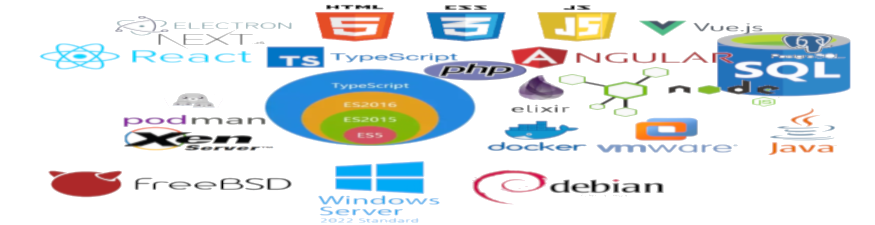
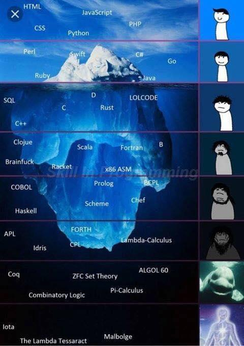

# I love to learn


- [X] This profile was sent using automatic translator

### Find me elsewhere 🌎

[](https://www.linkedin.com/in/leonardo-batista-zimmermann-94363742/)

### Here are some technologies used over the years
<!--  -->


### Hi there 👋 I'm Leonardo, I've been a programmer for a few years, since 2007 to be more exact...
* However, the first projects were from 2012 ...
  * Mostly for infrastructure automation, with shell codes, for files and database backup and integrity checking ...
  * Multiple projects with CMS (Joomla, Drupal, Wordpress, Others) in PHP 
  * Some php projects, I build
  * And many, many hours of debugging and fixing third-party projects 
  * And so many hours doing documentation
  * I used it for testing and updated many projects on ragezone, open source game servers even 2016
  * And in 2018, I had a personal family loss that really made me lose the will to everything, but I kept working even harder than before so I didn't remember or feel, and two years after that I had another loss.
  * I am currently dedicating myself to learning how to create interfaces for end users using the newest technologies, or rather, high-level frameworks, using technologies that have been on the market for a long time (HTML, CSS, ECman Script), but are currently gaining visibility and are going through really amazing updates (The Modern Web)
> 
> 
> 
>  


<!--
**lbzconsultoria/lbzconsultoria** is a ✨ _special_ ✨ repository because its `README.md` (this file) appears on your GitHub profile.

Here are some ideas to get you started:

- 🔭 I’m currently working on ...
- 🌱 I’m currently learning ...
- 👯 I’m looking to collaborate on ...
- 🤔 I’m looking for help with ...
- 💬 Ask me about ...
- 📫 How to reach me: ...
- 😄 Pronouns: ...
- ⚡ Fun fact: ...
-->

### - 💬 Ask me about

### This session is for human resources ? Very Funny

* What is your salary expectation?
  > Answer:
- [ ] What is your company's annual revenue? It would be this value!
- [X] Salary close to the vacancy's ceiling, or compatible values for each function performed

* Can you talk a little about yourself?
  > Answer:
- [X] I am dedicated, hardworking and curious, fun, charismatic and sincere, extremely sincere, I like challenges in a quiet environment, I don't like to be limited in the same horizon. 

* How did you find out about the vacancy?
  > Answer:
- [X] I searched and participated.
- [ ] Someone pointed me and the first answer applies. 
- [ ] The vacancy appeared mysteriously like in front of me. I do not think so. And the first answer applies.

  ```Why if not how would I be in this interview?```
  
* What do you know about the company?
  > Answer:
- [X] Nothing or something, though I promise I'll learn a lot about her if I get hired.  

* Why do you want this job?
   > Answer:
- [ ] Money, to pay bills, buy things! Why would anyone work if it were for that reason? Maybe for love!? Uhm... No, this is a hobby.
- [X] Learn to improve myself, make friends and future customers. And the first answer applies.

* Why should we hire you?
  > Answer:
- [X] Well first I can be the solution to your problems, and we will only find out if this opportunity arises.

* What are your strengths?
  > Answer:
- [X] I am dedicated, hardworking and curious, fun, charismatic and sincere

* What are your weaknesses?
  > Answer:
- [X] Pessimistic and suspicious, I believe it is a good trait, I have more confidence in my decisions
  
* What was your first line of code and language you programmed?
  > Answer:  This was first code written, yeaah C, yes sir !

```C
#include <stdio.h>

int main()
{
    printf("Hello World");

    return 0;
}

```
* What is your schooling?
> Answer: Complete High School !

  * Didn't you go to college?
> Answer: Yes, Software Analysis and development, I did but not finished.

  * Do you intend to finish college?
> Answer: Yes, I'd like to leave it framed, saying I'm a graduate, yuuup, now the diploma will program and all the problems for me.

#### Human Resources Possible scenarios 
- [ ] Unfortunately without the degree I can't hire you 

 ```Okay, you're the one who's losing...``` 

- [X] Want to take a 5 day trial?
      
```Of course I'm available! If it is within your expectations, we will combine the salary and working hours! ```

### Meme very funny (Where are you)

